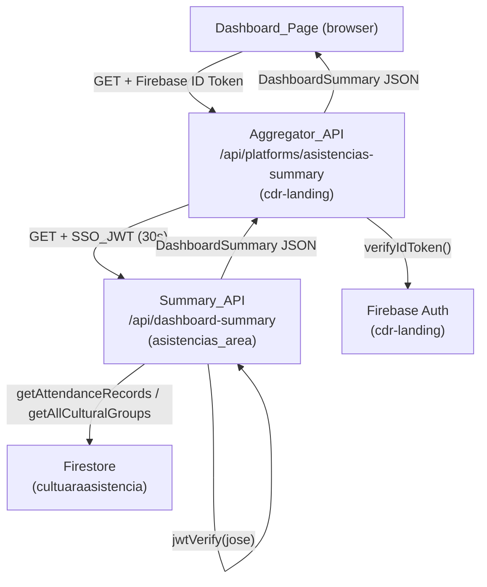
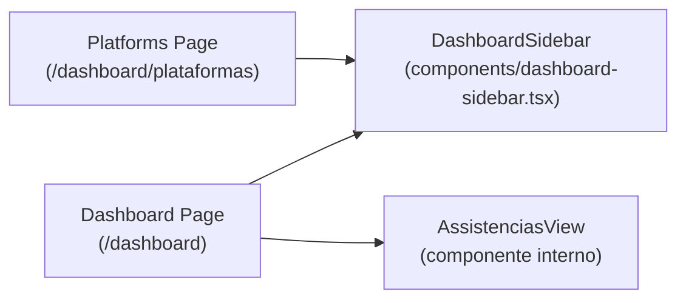

# Design Document: admin-dashboard-asistencias

## Overview

Este diseño cubre la transformación del dashboard de administrador en `cdr-landing` en un panel analítico con sidebar fijo, la creación de una API de resumen en `asistencias_area`, un aggregator seguro en `cdr-landing`, y una página de plataformas separada.

El flujo de datos es:
1. El cliente (Dashboard_Page) obtiene un Firebase ID Token de `auth.currentUser.getIdToken()`.
2. El cliente llama al Aggregator_API en `cdr-landing` con ese token.
3. El Aggregator_API verifica el token con Firebase Admin SDK, genera un SSO_JWT de corta duración (30s) y llama a la Summary_API en `asistencias_area`.
4. La Summary_API verifica el SSO_JWT con `jose`, lee Firestore y retorna el `DashboardSummary`.
5. El Aggregator_API retorna el JSON al cliente.

**Decisiones de diseño clave:**
- El cliente nunca toca `SSO_SECRET` ni credenciales de Firestore de `asistencias_area`.
- Se usa `jose` (ya instalado en `asistencias_area`) para verificar JWTs en el servidor, compatible con el Edge Runtime.
- En `cdr-landing` se usa `jsonwebtoken` (ya instalado, ver `sso-token/route.ts`) para firmar el SSO_JWT server-to-server.
- Los Route Handlers siguen el patrón `export async function GET(request: Request)` de Next.js 16 (Web API estándar).
- CSS Modules exclusivamente, sin Tailwind ni inline styles masivos.
- Recharts para todas las gráficas (ya instalado `^3.8.0`).

---

## Architecture





---

## Components and Interfaces

### 1. `asistencias_area/app/api/dashboard-summary/route.ts`

Route Handler GET. Responsabilidades:
- Extraer el Bearer token del header `Authorization`.
- Verificar con `jose` (`jwtVerify`) usando `SSO_SECRET`.
- Validar que `payload.role` sea `'ADMIN'` o `'SUPER_ADMIN'`.
- Llamar a `getAttendanceRecords('cultura')` y `getAllCulturalGroups('cultura')`.
- Computar y retornar el `DashboardSummary`.

```typescript
// Firma del handler
export async function GET(request: Request): Promise<Response>
```

Función de agregación interna (pura, testeable):
```typescript
export function computeDashboardSummary(
  records: AttendanceRecord[],
  groups: CulturalGroup[],
  now?: Date
): DashboardSummary
```

### 2. `cdr-landing/app/api/platforms/asistencias-summary/route.ts`

Route Handler GET. Responsabilidades:
- Extraer el Firebase ID Token del header `Authorization`.
- Verificar con `adminAuth.verifyIdToken()`.
- Generar SSO_JWT con `jsonwebtoken` (`role: 'SUPER_ADMIN'`, `expiresIn: '30s'`).
- Hacer `fetch` a `${NEXT_PUBLIC_URL_ASISTENCIAS}/api/dashboard-summary`.
- Retornar el JSON al cliente.

```typescript
export async function GET(request: Request): Promise<Response>
```

### 3. `cdr-landing/components/dashboard-sidebar.tsx`

Componente React Client (`'use client'`). Props:

```typescript
interface DashboardSidebarProps {
  activeSection: 'asistencias' | 'plataformas'
  user: RCDUser
  onSignOut: () => void
}
```

Estructura visual:
- Logo CampusFlow + icono hexágono (arriba).
- Sección "Dashboards": item "Asistencias" → `/dashboard`.
- Sección "Plataformas": item "Ver todas" → `/dashboard/plataformas`.
- Item activo resaltado con fondo `rgba(255,255,255,0.1)` y color blanco.
- Chip de usuario + botón logout (abajo).
- Oculto en viewport ≤ 900px (media query en CSS Module).

### 4. `cdr-landing/app/dashboard/page.tsx` (rediseñado)

Componente Client. Responsabilidades:
- Renderizar `DashboardSidebar` con `activeSection="asistencias"`.
- Obtener Firebase ID Token y llamar al Aggregator_API.
- Gestionar estados: `loading`, `error`, `data`.
- Renderizar topbar con botón "Abrir Asistencias" (SSO).
- Renderizar `AssistenciasView` con los datos.

### 5. `AssistenciasView` (componente interno o separado)

Puede vivir en `cdr-landing/components/asistencias-view.tsx`. Props:

```typescript
interface AssistenciasViewProps {
  data: DashboardSummary
}
```

Contiene:
- 4 KPI cards.
- 2 gráficas de torta (Recharts `PieChart`).
- 2 gráficas de barras horizontales (Recharts `BarChart` con `layout="vertical"`).
- 1 gráfica de línea full-width (Recharts `LineChart`).

### 6. `SkeletonDashboard` (componente interno)

Placeholders animados para el estado de carga. Implementado con CSS Module (animación `@keyframes pulse`).

### 7. `cdr-landing/app/dashboard/plataformas/page.tsx`

Componente Client. Responsabilidades:
- Renderizar `DashboardSidebar` con `activeSection="plataformas"`.
- Mostrar las tarjetas de módulos filtradas por `user.platforms` (misma lógica que el dashboard actual).
- Botón SSO en cada tarjeta usando `handleModuleClick`.

---

## Data Models

### `DashboardSummary`

```typescript
interface DashboardSummary {
  totalAsistencias: number
  participantesUnicos: number
  gruposActivos: number
  asistenciasMesActual: number
  asistenciasMesAnterior: number
  porGenero: {
    mujer: number
    hombre: number
    otro: number
  }
  porEstamento: Record<string, number>
  top5Grupos: Array<{ nombre: string; total: number }>
  gruposBajos: Array<{ nombre: string; total: number }>
  tendencia6Meses: Array<{ mes: string; total: number }> // YYYY-MM
}
```

### Lógica de cómputo en `computeDashboardSummary`

```
totalAsistencias       = records.length
participantesUnicos    = new Set(records.map(r => r.numeroDocumento)).size
gruposActivos          = groups.length
asistenciasMesActual   = records.filter(r => sameMonth(r.timestamp, now)).length
asistenciasMesAnterior = records.filter(r => sameMonth(r.timestamp, prevMonth(now))).length

porGenero = records reducidos por r.genero.toLowerCase() → { mujer, hombre, otro }
porEstamento = records reducidos por r.estamento → Record<string, number>

top5Grupos = agrupar records por grupoCultural, ordenar desc, tomar 5
gruposBajos = agrupar records del mes actual por grupoCultural, ordenar asc, tomar 5

tendencia6Meses = para cada uno de los 6 meses anteriores (incluyendo actual):
  { mes: "YYYY-MM", total: count de records en ese mes }
```

### Variación porcentual (badge KPI)

```
variacion = asistenciasMesAnterior === 0
  ? null
  : Math.round(((asistenciasMesActual - asistenciasMesAnterior) / asistenciasMesAnterior) * 100)
```

---

## Correctness Properties

*Una propiedad es una característica o comportamiento que debe mantenerse verdadero en todas las ejecuciones válidas del sistema — esencialmente, una declaración formal sobre lo que el sistema debe hacer. Las propiedades sirven como puente entre especificaciones legibles por humanos y garantías de corrección verificables por máquina.*

### Property 1: Unicidad de participantes

*Para cualquier* conjunto de `AttendanceRecord`, `participantesUnicos` debe ser igual al tamaño del conjunto de valores distintos de `numeroDocumento`.

**Validates: Requirements 1.7**

### Property 2: Consistencia de totales por género

*Para cualquier* conjunto de `AttendanceRecord`, la suma de `porGenero.mujer + porGenero.hombre + porGenero.otro` debe ser igual a `totalAsistencias`.

**Validates: Requirements 1.6, 1.11**

### Property 3: Consistencia de totales por estamento

*Para cualquier* conjunto de `AttendanceRecord`, la suma de todos los valores en `porEstamento` debe ser igual a `totalAsistencias`.

**Validates: Requirements 1.12**

### Property 4: Top 5 grupos ordenados descendente

*Para cualquier* conjunto de `AttendanceRecord`, los elementos de `top5Grupos` deben estar ordenados de mayor a menor por `total`, y `top5Grupos.length <= 5`.

**Validates: Requirements 1.13**

### Property 5: Grupos bajos ordenados ascendente

*Para cualquier* conjunto de `AttendanceRecord` del mes actual, los elementos de `gruposBajos` deben estar ordenados de menor a mayor por `total`, y `gruposBajos.length <= 5`.

**Validates: Requirements 1.14**

### Property 6: Tendencia cubre exactamente 6 meses

*Para cualquier* fecha `now`, `tendencia6Meses` debe tener exactamente 6 elementos, con meses en formato `YYYY-MM`, ordenados cronológicamente, cubriendo los 6 meses más recientes incluyendo el actual.

**Validates: Requirements 1.15**

### Property 7: Mes actual + mes anterior son subconjuntos del total

*Para cualquier* conjunto de `AttendanceRecord`, `asistenciasMesActual + asistenciasMesAnterior <= totalAsistencias`.

**Validates: Requirements 1.9, 1.10**

### Property 8: Rechazo de JWT con rol no autorizado

*Para cualquier* JWT válido (firma correcta, no expirado) cuyo `role` no sea `'ADMIN'` ni `'SUPER_ADMIN'`, la Summary_API debe retornar HTTP 403.

**Validates: Requirements 1.3**

### Property 9: Rechazo de JWT inválido o expirado

*Para cualquier* token que no sea un JWT válido firmado con `SSO_SECRET`, o que haya expirado, la Summary_API debe retornar HTTP 401.

**Validates: Requirements 1.2, 1.4**

---

## Error Handling

### Summary_API (`asistencias_area`)

| Condición | HTTP | Body |
|---|---|---|
| Header `Authorization` ausente | 401 | `{ error: "Token requerido." }` |
| JWT malformado o firma inválida | 401 | `{ error: "Token inválido." }` |
| JWT expirado | 401 | `{ error: "Token expirado." }` |
| Rol no autorizado | 403 | `{ error: "Rol no autorizado." }` |
| Error de Firestore | 500 | `{ error: "Error interno del servidor." }` |

### Aggregator_API (`cdr-landing`)

| Condición | HTTP | Body |
|---|---|---|
| Header `Authorization` ausente | 401 | `{ error: "Token requerido." }` |
| Firebase ID Token inválido | 401 | `{ error: "Token de sesión inválido." }` |
| Summary_API retorna error | Propaga el status | Propaga el body |
| Error de red hacia Summary_API | 502 | `{ error: "Error al contactar el servicio de asistencias." }` |

### Dashboard_Page (cliente)

- Estado `loading`: muestra `SkeletonDashboard`.
- Estado `error`: muestra mensaje de error y botón "Reintentar" que re-ejecuta el fetch.
- Si `auth.currentUser` es null al momento del fetch: redirige a `/login`.

---

## Testing Strategy

### Enfoque dual

Se usan **unit tests** para ejemplos concretos y casos borde, y **property-based tests** para validar propiedades universales sobre la función pura `computeDashboardSummary`.

### Librería de property-based testing

Se usará **`fast-check`** (compatible con TypeScript, Jest y Vitest). Instalación: `npm install --save-dev fast-check`.

Cada property test debe ejecutar mínimo **100 iteraciones** (configuración por defecto de fast-check).

### Anotación de tests

Cada property test debe incluir un comentario de referencia:

```typescript
// Feature: admin-dashboard-asistencias, Property N: <texto de la propiedad>
```

### Unit tests (ejemplos y casos borde)

- `computeDashboardSummary` con array vacío → todos los campos en 0 o vacíos.
- `computeDashboardSummary` con registros de un solo género → los otros géneros en 0.
- Aggregator_API: mock de `adminAuth.verifyIdToken` que lanza → retorna 401.
- Summary_API: mock de JWT expirado → retorna 401.
- Summary_API: mock de rol `'MONITOR'` → retorna 403.
- Variación porcentual: mes anterior = 0 → variación = null (sin división por cero).

### Property tests (fast-check)

- **Property 1**: Generar arrays arbitrarios de `AttendanceRecord` → verificar `participantesUnicos === new Set(records.map(r => r.numeroDocumento)).size`.
- **Property 2**: Generar arrays arbitrarios → verificar `porGenero.mujer + porGenero.hombre + porGenero.otro === totalAsistencias`.
- **Property 3**: Generar arrays arbitrarios → verificar `sum(Object.values(porEstamento)) === totalAsistencias`.
- **Property 4**: Generar arrays arbitrarios → verificar `top5Grupos` ordenado desc y `length <= 5`.
- **Property 5**: Generar arrays arbitrarios con fecha `now` → verificar `gruposBajos` ordenado asc y `length <= 5`.
- **Property 6**: Generar fechas arbitrarias → verificar `tendencia6Meses.length === 6` y orden cronológico.
- **Property 7**: Generar arrays arbitrarios → verificar `asistenciasMesActual + asistenciasMesAnterior <= totalAsistencias`.

Los tests de las Properties 8 y 9 (validación JWT) se implementan como unit tests con mocks de `jose`, ya que dependen de comportamiento de red/criptografía.
